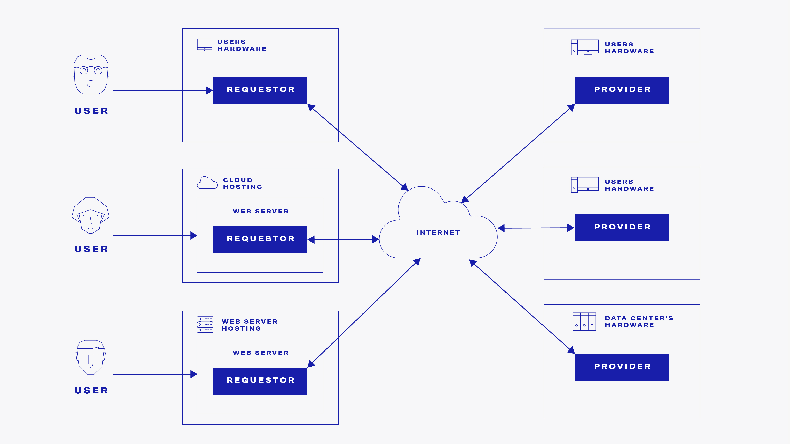

# The Golem SDK documentation


Looking for a quick start? [Dive into our requestor development primer!](tutorials/flash-tutorial-of-requestor-development.md)



The current Alpha release of The Next Milestone, the first New Golem iteration, is aimed at requestors.   
Providers, don't despair!   
We'll be adding the ability to become a provider in one of the upcoming reveals.   
Moreover, if you'd like to provide computing power to the Golem Network now, and get rewarded in GNT, [our Clay Golem Beta implementation](https://golem.network/products/clay-beta/) allows this.


## What is Golem?


Golem is a global, open source, decentralized supercomputer that anyone can use. It is made up of the combined computing power of the users' machines, from PCs to entire data centers.


Under the hood, Golem is a decentralized marketplace where IT resources such as computation hardware are rented out. The actors in this decentralized network can assume one of the two non-exclusive roles:

* **Requestor**

Has a need to use IT resources such as computation hardware. Those resources are purchased in the decentralized market. The actual usage of the resources is backed by Golem's decentralized infrastructure.

* **Provider**

Has free IT resources that can be shared with other actors in the network. Those resources are sold in the decentralized market.

Both requestors and providers may be launched on different types of hardware. Those can be laptops, desktop computers, servers, and cloud environments. In the requestors' case, it is also feasible for them to be executed on mobile devices.

## How can I benefit from Golem?

There are two ways to leverage the platform: 

### **Develop a Golem-based product**

Our decentralized stacks offer a unique opportunity for software developers. 


Ensuring that the development of products based on Golem is smooth and effortless is our core business.


 **Plus, there are no licensing fees.**  

If you're interested, please have a look at: 


### **Become a Golem provider**

We will be enabling the providers to leverage New Golem soon. 

Those wishing to take this role, will be able to install a Golem Network provider package, share their hardware resources, and **have a passive income stream straight to their** [**ethereum**](https://ethereum.org/) **addresses**.

Please note that New Golem is in its very first stag**es. At first, support will be quite limited, probably to Linux. In the future, we will be adding wider support.** 

While you wait, you could start earning passive income now via [our Clay Golem Beta implementation](https://golem.network/products/clay-beta/) \(Legacy Golem\), which is on mainnet.

## Golem's mission - free, open-source, censorship-resistant, and democratized access to computing power for all:  


Golem is open-source software. All the code is available under the GPL license.

[https://github.com/golemfactory/yagna](https://github.com/golemfactory/yagna)


## Developers' area: 

This is the documentation that's aimed at developers contributing to the Golem infrastructure codebase::



\*\*\*\*

