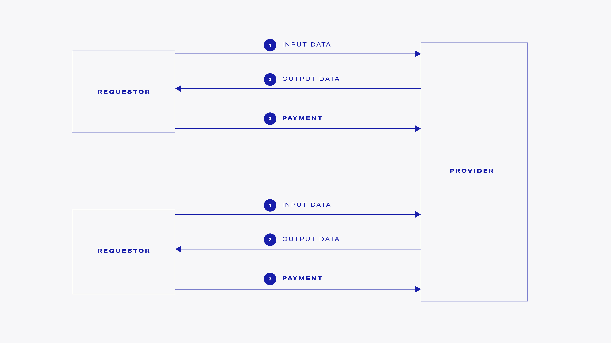

# Provider

## What is a provider?

A provider agent - as understood in the context of the Golem network is a specific piece of code running on an Internet-connected device. The code implements the Golem network protocol, thus the machine running it acts as an node in Golem.

The characteristic that describes the provider agent is the sharing of hardware resources within the Golem network.

In general, almost any computer might act as a provider. It can be a laptop, desktop, or a server machine. The particular resource details \(for example, the number of CPUs or its memory limit\) that are subject to sharing can be configured by the hardware owner.


The provider binaries are available as a pre-built Linux installation package. You do not need to perform any development or extensive configuration to have a Golem provider up and running on your Linux machine.




## What does a provider do?

1. The provider announces the availability of its resources in the Golem market. This announcement is called an offer.
2. The Golem market performs the matching between provider side offers and requestor side demands.
3. If there is a requestor willing to use the provider's resources, the transaction is arranged.
4. The resources are used by the requestor \(for example by transferring input/output files and running a particular docker container on the provider's hardware\).
5. The provider bills the requestor.
6. The requestor performs an [Ethereum](https://ethereum.org/) payment for resource usage.

## How can I benefit from running a provider on my machine?

After installing and running the Golem provider you will start participating in the Golem network in the following way:

* serving other actors in the Golem network that are in need of IT resources with your hardware that is currently not in use
* receiving payments for the resources you share

The typical resource usage scenario is as follows: after receiving the input data, the processing is performed by your machine. Next, the output data is sent back to the requestor and the payment is executed through [Ethereum](https://ethereum.org/).

