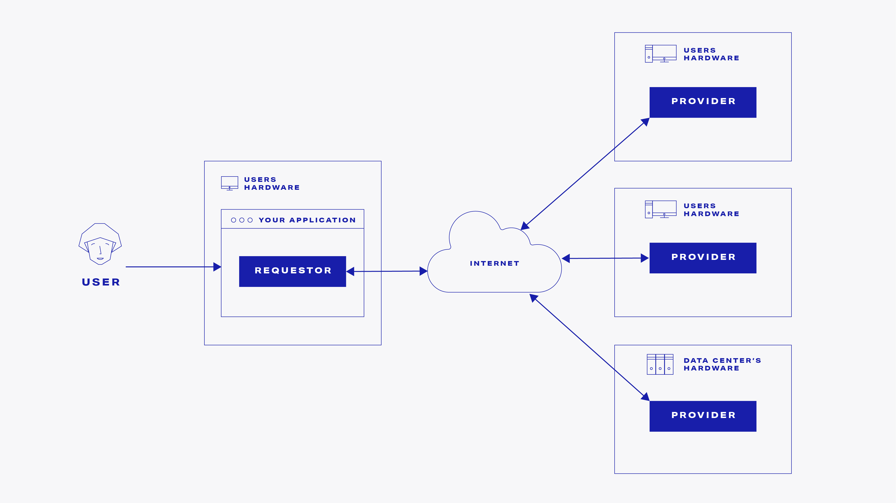
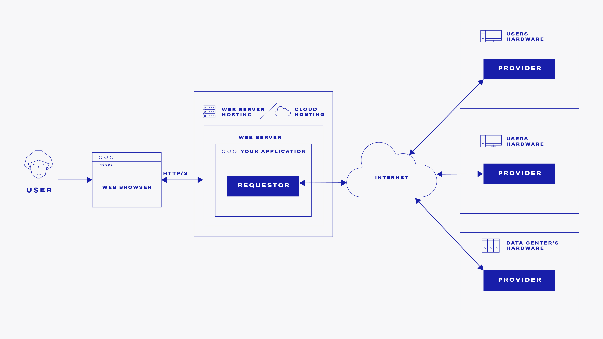

# Requestor

## What is a requestor?

A Golem requestor is a specific piece of code running on an Internet-connected device.

**The characteristic that describes the requestor agent is the need to use hardware resources that are available in the Golem network, shared by its providers.**


Because local hardware resources on your desktop, mobile device, or even server machine are always limited, there is always some task that the local, requestor's hardware can not perform in a reasonable time frame or not at all \(for example because of memory limit\).

There are no set limits on the resources available in Golem. Requestors can use as many resources as they need. All of those hardware resources can be used at the same time thus reducing _**hour- or day-long computations to seconds.**_


## What does a requestor do?

The typical use case for the requestor is as follows:

* **Define the need**

Define the resources it needs. Those needs \(for example CPU and memory requirements or the type of runtime to run\) are then published in the form of a Demand in Golem's decentralized market.

* **Acquire access to the resources**

If the decentralized market contains offers previously announced by the providers that match the requirements of the particular requestor's demand, the resources thereby offered are ordered for use by the requestor.

* **Use the resources**

The actual usage depends on the nature of the resources. For now, the most common scenario is performing computations, but Golem is not limited to this use case. It may also involve e.g. launching some long-running services which respond to requests coming from the requestor or from the outside world.

* **Pay for the resources usage**

The last step is to pay for the usage of the resources. There are many possible payment scenarios. Currently the default is to use a Layer-2 solution called zkSync to save on transaction costs but a regular payment driver using ERC-20 GLM transfers is also available. In near future we will enable even more ways to effect payments - we're currently using Polygon in [Thorg](https://www.thorg.io/) and the support thereof will soon make it to mainline yagna.

## How requestors are made and used?

As requestors are based on each specific business need there is no single requestor agent that fits all the use cases.


We do not provide any predefined requestor binary, as it is up to third parties to develop products on top of Golem. We do provide [SDKs](../requestor-tutorials/flash-tutorial-of-requestor-development/run-first-task-on-golem.md) through which such requestor agents can be implemented, though.


There are many possible scenarios defining the actual form and shape of a product that is based on Golem.

### Requestor running on the user's device

The simplest scenario is when the requestor binary is running on a device that the end-user has physical access to, e.g.:

* a mobile device \(phone/tablet\)
* a laptop
* a desktop box

In this scenario, your product front-end layer and the requestor can be integrated into one binary package.

### Webserver-based requestor

In this scenario, it doesn't matter what the end user's local device is, as long as it can run a web browser.

Here, your application code is running inside a web server and the front-end layer is accessed through a browser.


To write a fully functional requestor you need to write just a few lines of code.

Golem's APIs, the daemon and the infrastructure take care of the rest.


The basic requestor development tutorial is here:



## How can I benefit from being a requestor?

The main or most typical benefit for the requestor is to have instant access to a very large pool of hardware. Instead of using local hardware, the requestor is able to use the IT resources available on the decentralized market.


Remember that one requestor can use the hardware from many providers at the same time.


For instance, you could think of training a large ML model in seconds instead of hours.

## How does a Requestor work?

For the basic computations scenario the details of the resource usage are as follows:

* Specify the payload to use: 
  * a VM image:
    * based on existing Docker image, for example from the [docker hub](https://hub.docker.com/),
    * a custom VM image,
  * some other runtime, e.g. WASM or a custom runtime based on [runtime SDK](https://github.com/golemfactory/ya-runtime-sdk/).
* For each of the providers whose resources a requestor wishes to utilize, \(there is no set limit on the number\) define the files containing the input data for the computations.
* For each of the runtime containers created on the provider's hardware:
  * transfer the input files to a volume available within the  container.
  * execute the "run task" command \(actual command string is defined in the requestor agent code\)
  * transfer the output files from the container's volume to the requestor.

