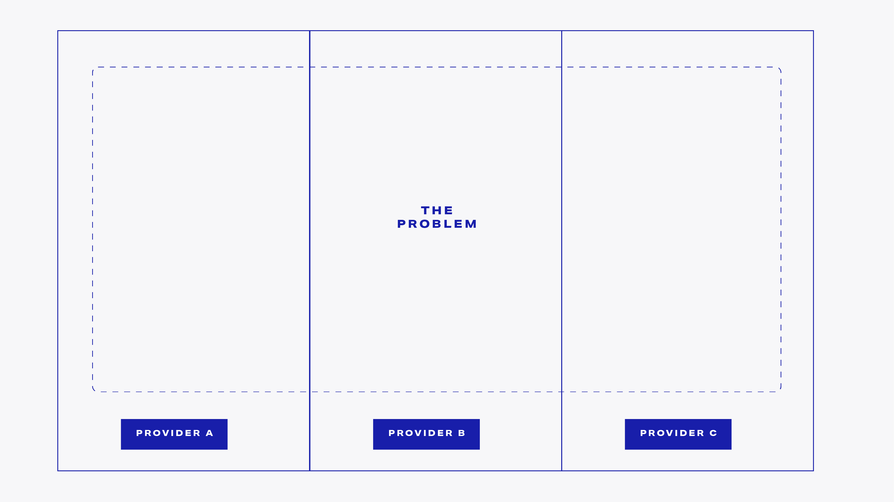

# Golem application - the basics

## What is a Golem application?

A Golem application consists of a certain number of execution units - e.g. VMs capable of running Docker images - launched within the network's provider nodes that are orchestrated by a requestor agent - a piece of code talking directly to the REST API on a requestor node.

Golem's execution units are theoretically capable of running code inside any environment that provides effective isolation of execution from the host. Currently Docker VMs and WASM are supported. The scope of this document is limited to the former.

So far, said orchestration takes a form of one of three types of actions: 

* sending input files to the execution unit
* running commands on the execution unit
* getting output files back from the execution unit

## How does a Golem VM application work?

### Components

The application depicted in this article consists of two distinct components:

* **Requestor** agent - splits the computation problem into several parts, and sends them to providers. After receiving all the results from the providers, the requestor combines them to form the final output that is passed to the user.
* **Provider** VM image - executes the given part and returns results to the requestor.

In case of a VM application, the Provider side is implemented as a docker image crafted for the desired purpose. It is the responsibility of the application's author to prepare a dedicated dockerfile that describes this custom image. Of course, it may happen that there already exists an image \(e.g. on Docker Hub\) that can be used directly - in such case, this step can be skipped.

### Execution flow

#### Requestor agent and market negotiation

The application's execution starts on the Requestor's end, when the user runs the requestor agent.

After specifying and publishing a demand to the Golem's market, the requestor agent receives offers from providers that meet its needs - e.g. having sufficient amount of RAM.

#### Docker image

Once agreements with the selected providers are finalized, which happens in the course of an automated negotiation process, the providers are asked to load the appropriate image. 


_If this is a subsequent run of the image, the image could already be cached by some of the providers._


#### Input data

The task is then split into fragments and each provider can receive one or more of such fragments. Each fragment is described by a certain set of input data - part of which can be common for the whole task and part of which may be specific for the given fragment. The prepared data is then sent - either directly from the memory, or from requestor's local file system - to the provider and further, into the Docker container's file system on the provider's execution unit.

#### Execution script

A script consisting of one or more commands is executed by the execution unit using the providers' docker containers.


It is expected that in the result of the command execution, in the docker container's file system there are some files that can be transferred to the requestor.


#### Output

The requestor agent needs to transfer the output files from the provider's docker container's file systems to its local file system.

The agent then combines all the data transferred from providers to form the final output that can be consumed by the application user.

To learn about some additional details on how different parts of Golem work together, please have a look at:







## How do I start?

First, you need to think about your computational problem in terms of parallel execution. Let's visualize your computational problem:

Next, you need to find a way how to divide the whole problem into fragments. Each fragment is a distinct part of the whole and may be processed by a different provider, independently from other fragments:

In order to proceed further, you'll be required to design your app in such way that it's able to:

1. Translate the problem fragments into input and output files the processing of which is performed independently in each of the providers.
2. Combine all the output files into the final solution of the problem at hand.

## What do I need to create a VM application for Golem?

When it comes to the implementation itself, and as has been already mentioned above, any VM-based application for Golem is made up of two components:

1. a Docker image that will run as a container on providers.
2. Requestor agent - a piece of Python / JavaScript / TypeScript code that will execute the problem-dividing logic, orchestrate the execution on providers and finally combine the output files to get the result for the whole problem.


Now you know what a Golem VM application is and how it works. 


Let's see how the implementation goes then! But first, let's understand how `hashcat`, the password-recovery tool which we are going to use, can be made to work in parallel.

