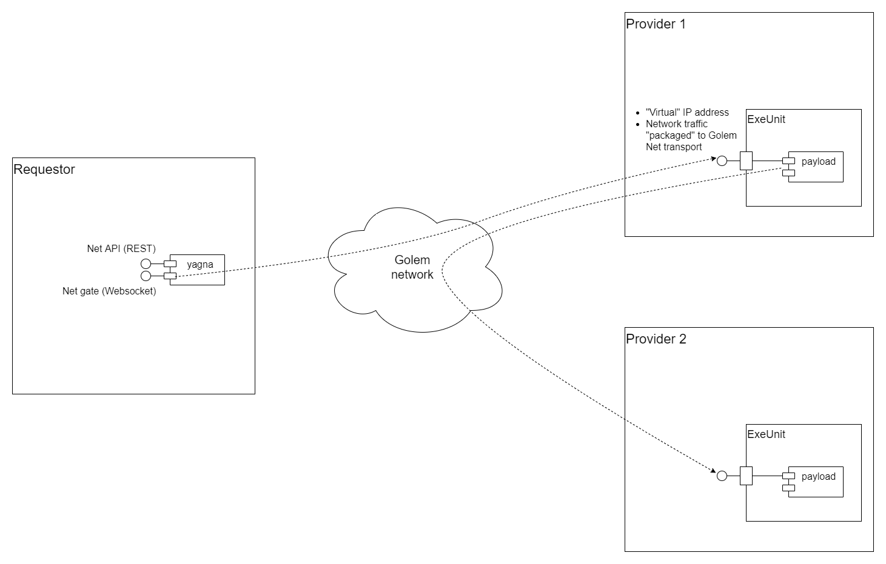

# Golem VPN networking concept

## Intro

Golem ecosystem allows for building distributed applications, where multiple Provider nodes are instantiated and coordinated by a central Requestor. Such applications may include payloads which require connectivity **between Provider nodes**.

Golem VPN feature has been designed to provide such connectivity in a manner which is as close as possible to standard network connectivity mechanisms.  Payloads must be ignorant of the fact that the Provider host is embedded in Golem network and all network traffic happens in Golem network itself. 

Golem VPN requires specific implementation in the ExeUnit/runtime, which must be capable of providing a standard Unix-socket interface to their payloads, and marshalling the logical network traffic through the Golem Net transport layer - thus achieving actual both Virtual and Private networking capabilities.  


The Golem VPN mechanism enables node-to-node connectivity, implemented on the back of Golem Net transport layer. It does not provide node-to-Internet, nor Internet-to-node connectivity.


### Features

The Golem VPN concept includes following key features:

* Network configuration is controlled via a Net API - a RESTful API available on `yagna` service \(alongside eg. Market API or Activity API\). Net API endpoints allow for defining logical Golem VPN network, adding/removing nodes \(visible in the network under their "virtual" IP addresses\)
* Allow Provider-side payload to open a listening net socket to accept incoming network traffic. **Note** this generally allows to launch typical server applications leveraging TCP/IP protocol, like HTTP servers, telnet/SSH servers, messaging or file servers, etc. Connection-less protocols \(like UDP or ICMP\) are also supported.
* Allow Provider-side payload to create network connections to another Provider-side payload in the same "virtual" network. 
* Allow an application on Requestor side to open network communication channel to a payload module running on a selected Provider node. This is achieved using a Websocket-based Net "gate" published by `yagna` service running on Requestor side, which provides authenticated access to a Golem VPN network.
* The network traffic between the nodes is marshalled over Golem network, so all features of Golem net apply. 
* The logical model of Golem VPN allows for any IP-based network protocol to be wrapped in Golem network transport layer, however the protocols actually supported are specific to ExeUnit runtime implementation.

### Configuration

A Golem VPN requires configuration which defines the mapping of "virtual" IP addresses to nodes. The VPN configuration includes following entries/structures:

* Network
  * Network id
* Nodes
  * Golem node id
  * Virtual IP address

The configuration is specified via calls to Net API. The nuances of Net API calls are wrapped by Golem High Level APIs to simplify developer's experience.

### Golem VPN setup sequence

A typical VPN setup sequence of activities performed by a Golem application is as follows:

* **Create network** - a logical network record gets created and is ready to accept "virtual" nodes.
* **Create agreement and start activity** - identify a Provider node and launch an activity.
* **Add node** to network - once a Provider is identified and contracted, its node id can be added to virtual network under a "virtual" IP.
* **Exec\(DEPLOY\)** - send DEPLOY command to the Provider's ExeUnit. At this point the network configuration is passed to the ExeUnit, which can initiate its network intrfaces to connect the ExeUnit \(and payload\) to the VPN.
* Run payload...
* **Remove node** from network - once the Provider node is no longer needed, it gets removed from the VPN network. 

### Caveats

While the Golem VPN feature is being implemented, it still includes known gaps or deficiencies, such as the ones listed below:

* Once a Provider node is added to the VPN and ExeUnit launched and connected to this network - its network configuration \(including virtual IP address\) cannot be changed.
* IPv4 is supported.
* Multicast is not supported.
* Marshalling generic network traffic over Golem Net layer incurs substantial overhead \(eg. due to TCP-over-TCP layering\)
* Custom ExeUnit runtime SDK allows for implementing Golem VPN capability, but does not include a default/reference implementation. 

### Examples

Feel free to explore examples which illustrate usage of Golem VPN features in practice:





