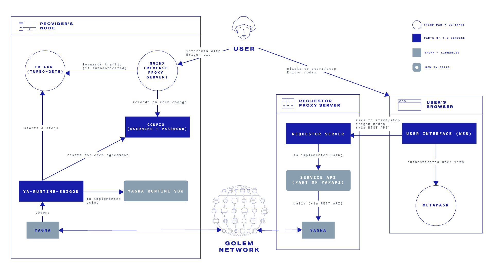

# Service Example 2: Managed Erigon

The purpose of this example is to demonstrate building a Golem service using a dedicated, self-contained runtime. It features an Ethereum network client, Erigon (f.k.a. Turbo-geth) started on provider nodes on user's demand. Interaction with the service is *not* facilitated by Golem though.


This example illustrates following Golem features & aspects:

* Dedicated service runtime implemented with [ya-runtime-sdk](https://github.com/golemfactory/ya-runtime-sdk)
* Service management using [yapapi-service-manager](https://github.com/golemfactory/yapapi-service-manager)



All code for this example can be found in this repository: [https://github.com/golemfactory/yagna-service-erigon/](https://github.com/golemfactory/yagna-service-erigon/)


## Architecture overview

The application consist of three major components:

1. **User interface**  
   A browser-based interface written in TypeScript using [React](https://reactjs.org/). It allows the end user to interact with the application, i.e. start an Erigon node after authenticating with their [Metamask](https://metamask.io/) wallet, and later manage their node(s).
2. **Requestor server**  
   A Python application developed using [Quart](https://pgjones.gitlab.io/quart/) and [yapapi-service-manager](https://github.com/golemfactory/yapapi-service-manager). It acts both as an HTTP server handling requests from the user interface, and as a requestor agent submitting tasks to the Golem network.
3. **Erigon runtime**  
    A dedicated, self-contained runtime created with [ya-runtime-sdk](https://github.com/golemfactory/ya-runtime-sdk). It is a Rust binary wrapping [Erigon](https://github.com/ledgerwatch/erigon) service itself so that it can be orchestrated by yagna daemon. The runtime also controls the access to the service by managing [Nginx](https://www.nginx.com/) configuration.
   
A typical interaction flow proceeds in the following manner:

1.
2.
3. ...

## Runtime implementation

## Requestor agent

## User interface

