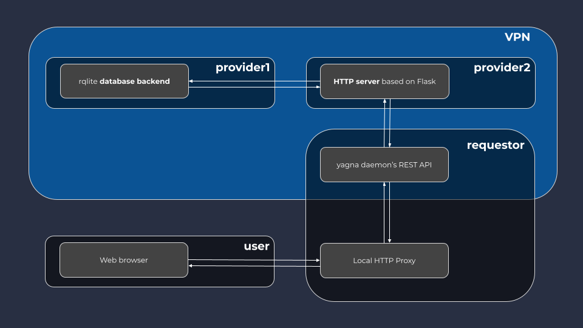

# Service Example 3: Simple Web application


Here, we're presenting you the usage of:

* Golem VPN
* Local HTTP Proxy
* Yapapi Services

Full code of the example is available in the yapapi repository: [https://github.com/golemfactory/yapapi/tree/master/examples/webapp](https://github.com/golemfactory/yapapi/tree/master/examples/webapp)



## Introduction

In this article, we'd like to showcase to you a simple web application, representing a typical set-up consisting of an HTTP back-end that connects to an SQL database.

Both services here are running on separate provider nodes and are connected to both each other and to the requestor through a VPN.

In case you'd like to experiment yourself, and it's your first contact with Golem app development, you're invited to first have a look at our [requestor development primer]((../flash-tutorial-of-requestor-development/)) which will guide you through the introductory steps.

## Application outline

As you see in the above diagram, the application consists of:

* two services running inside VM containers on the provider nodes:
   * **rqlite database backend** - rqlite is, according to its authors, an "easy-to-use, lightweight, distributed relational database, which uses SQLite as its storage engine". All of these features make it an ideal candidate for a DB back-end of a Golem application. Especially its clustering capabilities sound interesting for a more advanced use case where we replicate the database across several providers to improve its survability and leverage the distributed nature of Golem itself.
   * **a Flask-based HTTP server** - 

