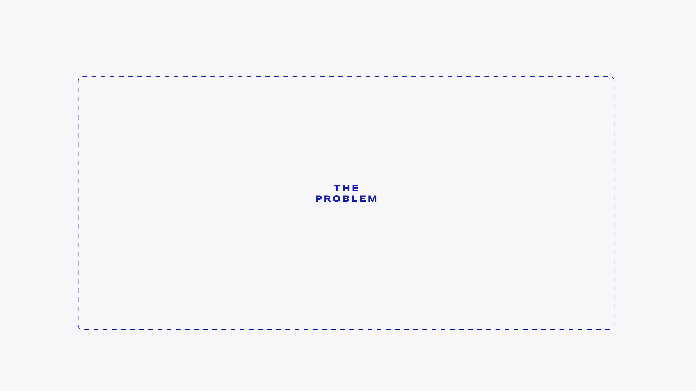

# Introduction to the task model

## How do I start?


This example uses the standard VM runtime.


First, you need to think about your computational problem in terms of parallel execution. Let's visualize your computational problem:

Next, you need to find a way how to divide the whole problem into fragments. Each fragment is a distinct part of the whole and may be processed by a different provider, independently from other fragments:

In order to proceed further, you'll be required to design your app in such a way that it's able to:

1. Translate the problem fragments into input and output files the processing of which can be performed independently on each of the provider nodes.
2. Combine the individual outputs into the final solution of the problem at hand.

It's worth noting here that the number of fragments does not necessarily need to depend on the number of provider nodes commissioned to perform our tasks. The high-level API will spawn activities on multiple providers as long as there are providers willing to fulfill our demand and up to the number of said fragments or up to the limit specified by `max_workers` parameter of `execute_tasks` \(Python\) / `submit` \(JS\). If the eventual number of fragments is higher than the number of workers, the API will take care of distributing those fragments against the available nodes in an optimum way.

## What do I need to create a VM application for Golem?

When it comes to the implementation itself, any VM-based application for Golem is made up of two components:

1. a Docker image that will run as a container on providers.
2. Requestor agent - a piece of Python / JavaScript / TypeScript code that will execute the problem-dividing logic, orchestrate the execution on providers, and finally combine the output files to get the result for the whole problem.


Now you know what a Golem VM application is and how it works.


Let's see how the implementation goes then! But first, let's understand how `hashcat`, the password-recovery tool which we are going to use, can be made to work in parallel.

