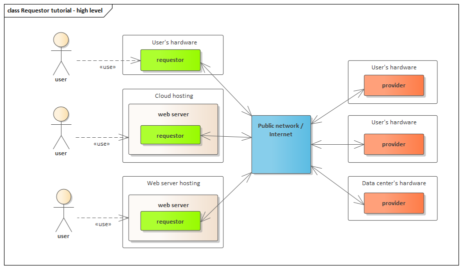

# Requestor development tutorial

## What is golem network ?

Golem network is decentralized marketplace where IT resources such as computation hardware are both and sold. The network is made of two types of actors:

* **Requestors**

Has a need to use some IT resources such as computation hardware. Those resources are both in the decentralized market. Also the actual usage of the resources is backed by the golem network decentralized infrastructure.  

* **Providers**

Has IT resources that can be shared with other actors in the network. Those resources are sold in the decentralized market.

Both requestors and providers might be executed in different types of hardware. Those can be laptops, desktop computers, servers and cloud environments. For the requestors it is also feasible to be executed on mobile devices.

## What does requestor do?

Typical use case for the requestor is as follows:

* **Define the need**

Define the IT resources it needs. Those needs \(for example CPU and memory requirements\) would be than by the golem infrastructure published in the decentralized network in a form of so called Order. 

* **Buy the resources**

If in the decentralized market there are Offers that match requirements of the Order, the resources offered by the provider are both to be used by the requestor.

* **Use the resources**

The actual usage depends on the resources. For now most common scenario is performing computations, but golem network is not limited to this use case.

* **Pay for the resources usage**

The last step is to pay for the usage of the resources \(unless the provider is offering them for free :\). There are many possible payment scenarios, but Ethereum based payment is default one.

## How can I benefit?

Typical benefit for the requestor is being able to have instant access to very large pool of computational hardware.  Instead of using local hardware, the requestor is able to use IT resources aviable on the decentralized market. 

**Please mind that one requestor can use hardware from many providers at the same time.** Think about training large ML model in seconds instead of hours. This is just example, as there are many interested business use cases described in the:



For the basic computations scenario the details of the resource usage are as follows:

Specify what docker image to use  / create custom docker image.

For each of the used providers \(there is no limit here on the number :\) define the files containing the input data for the computations.

## How can I develop golem network requestor?

## Development

### Prerequsites

### Requestor agent code

### How does it work?

## Running the requestor

## Next steps

